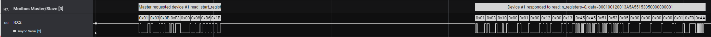

# Modbus RTU Master/Slave

This is a High Level Analyzer (HLA) for Saleae Logic which can parse Modbus RTU traffic
on a serial line. It should be hooked up to an Async Serial analyzer.

Currently only a few Modbus function codes are supported:

* 03: Read holding registers
* 16: Write multiple registers

It has some benefits over the built-in modbus analyzer:

